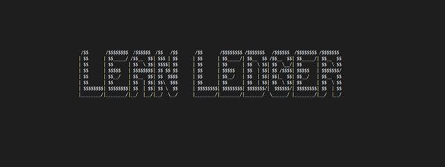

# 💸 Lean Ledger - Cash Flow Minimizer

> **"What if splitting group expenses or settling dues was no longer a headache?"**

Introducing the **Lean Ledger** – a smart, algorithm-powered cash flow minimizer designed to reduce clutter in financial settlements by intelligently minimizing the number of transactions required.

 <!-- Replace with actual image path -->

---

## 🧩 Problem

In group transactions (trips, clubs, societies, or shared expenses), it's common to track who owes whom. But when it comes time to settle, multiple overlapping debts lead to inefficient payment chains.

👎 *Manually managing debts leads to:*

* Multiple redundant transactions
* Confusing settlements
* Wasted time and effort

---

## 💡 Solution

The **Cash Flow Minimizer** is a smart ledger that simplifies group settlements by:

* 🔁 **Reducing total transactions** needed to settle all debts.
* 📊 **Tracking all participants, payment modes, and transaction histories**.
* ⚙️ **Applying graph theory** and the **Net Amount Algorithm** for optimal settlement.
* 💾 Fully implemented in **C++** using **file handling**, **classes**, and **graphs**.

---

## 💡 Key Features

* 👤 Add/Delete/Edit/View Participants
* 💰 Record/Edit/View/Delete transactions
* 🧾 Display transaction histories (sorted/unsorted)
* 🔃 Minimize total transactions to settle all debts
* 💳 Manage multiple payment modes per user
* 🧠 Uses graph theory for **cash flow minimization**
* 🔐 Stored locally using efficient binary file handling

---

## 🏗️ System Architecture

### 📌 Class Diagram

 <!-- Replace with actual image from PDF -->

---

### ⚙️ Data Structures & Algorithms

* **Participant Class**: Stores user info and allowed payment modes.
* **Transaction Class**: Stores individual debt relations.
* **Graph-based Adjacency Matrix**: Models debts between participants for optimization.
* **Set & Map**: For tracking payment types and indexing users.
* **Greedy Net Amount Minimization Algorithm**

```cpp
struct Participant {
    string name;
    string username;
    vector<string> paymentModes;
};

struct Transaction {
    string payee;
    string debtor;
    float amountPaid;
};
```

---

## ⚙️ Algorithms & Logic

### 🔍 Cash Flow Minimization Algorithm

1. Compute net balance for each participant.
2. Use a **graph** to represent debts.
3. Apply a **greedy strategy** to transfer maximum amount between debtors and creditors using **shared payment modes**.
4. Output the optimal list of settlements.

---

### 📈 Time & Space Complexity

| Operation              | Time Complexity | Space Complexity |
| ---------------------- | --------------- | ---------------- |
| Sorting Records        | O(n log n)      | O(n)             |
| Cash Flow Minimization | O(V²)           | O(V²)            |

---

## 📈 Screenshots & Outputs

### 💡 Interactive Terminal Menu


---

### 🧾 Adding a Participant


---

### 💸 Recording Transactions


---

### 📄 Transaction History


---

### 📉 Sorted Transactions


---

### ⚖️ Optimized Cash Flow Output


---

## 🚀 Getting Started

### 🔧 Prerequisites

* C++ compiler (GCC/Visual Studio)
* Terminal (Linux/macOS/Windows)
* IDE: VS Code / Code::Blocks / DevC++

### ▶️ Compile and Run

```bash
g++ cash-flow-minimizer-main.cpp -o CashFlowMinimizer
./CashFlowMinimizer
```

---

## 🧪 Example Use Cases

* Splitting expenses during trips
* Managing shared society funds
* Peer-to-peer micro lending groups
* Expense tracking in small startups or events

---

## 📍 Future Scope

* 🌐 Web/GUI front-end (Qt or React)
* 🔌 API + Payment Gateway Support
* 🔐 Add authentication and role-based access
* ☁️ Cloud backup and multi-device sync
* 📱 Mobile App Port (Flutter/React Native)
  
---
